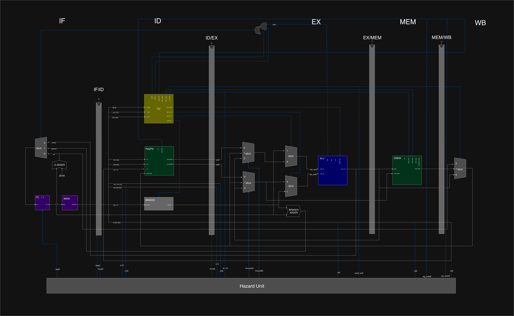
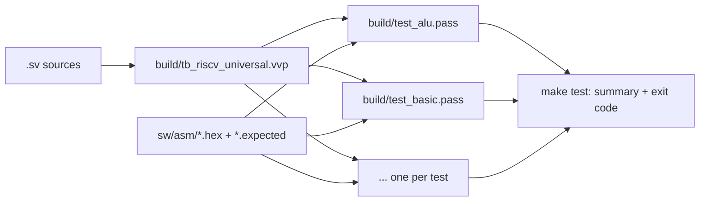

# riscv-core-pipelined

A 5-stage pipelined **RV32I** RISC-V CPU core written in SystemVerilog, with
full data forwarding, load-use stall detection, and branch/jump flushing.
It is verified by a self-checking testbench and a Make-based regression
harness that runs every test program and reports a pass/fail summary with a
CI-friendly exit code.



## Highlights

- **Classic 5-stage pipeline:** IF → ID → EX → MEM → WB, with pipeline
  registers between every stage.
- **Hazard unit:** forwarding from MEM and WB to EX, a 1-cycle stall for
  load-use hazards, and a flush on taken branches and jumps.
- **RV32I base integer ISA:** all computational, load/store, branch, and jump
  instructions (37 in total), including byte and halfword memory accesses
  with sign or zero extension.
- **Self-checking verification:** one universal testbench runs any program and
  checks registers and memory against an expected-results file.
- **One-command regression:** `make test` compiles once, runs every test, and
  exits non-zero if anything fails.

## Microarchitecture

### Pipeline stages

| Stage | What happens | Key modules |
|---|---|---|
| **IF** (Fetch) | Read the instruction at `PC`; compute `PC + 4`; choose the next PC | `pc`, `imem`, `adder`, `mux3` |
| **ID** (Decode) | Decode control signals, read the register file, generate the immediate | `control`, `regfile`, `immgen` |
| **EX** (Execute) | ALU operation with forwarded operands; resolve branches; compute branch/jump targets | `alu`, forwarding muxes, target `adder` |
| **MEM** (Memory) | Load from or store to data memory (byte / halfword / word) | `dmem` |
| **WB** (Writeback) | Select the ALU result, loaded data, or `PC + 4` and write it to the register file | result `mux3` |

The next PC is chosen from `PC + 4`, the branch/JAL target (`PC + imm`), or
the JALR target (`(rs1 + imm) & ~1`).

### Hazard handling

All hazard logic is in [`rtl/core/hazard.sv`](rtl/core/hazard.sv).

| Hazard | Detection | Resolution | Cost |
|---|---|---|---|
| **RAW data hazard** | An instruction in EX reads a register that an instruction in MEM or WB is writing | Forward the value to the ALU inputs (`forwardAE` / `forwardBE`). MEM has priority over WB because it holds the newer value. | 0 cycles |
| **Same-cycle write/read** | An instruction in ID reads the register being written back in WB | The register file forwards the write data straight to the read port (write-first) | 0 cycles |
| **Load-use** | A load in EX writes a register that the instruction in ID needs | Stall PC and IF/ID (`StallF`, `StallD`) and insert a bubble into ID/EX (`FlushE`) | 1 cycle |
| **Control** | A branch is taken, or a jump executes (resolved in EX) | Flush the two wrong-path instructions in IF/ID and ID/EX (`FlushD`, `FlushE`) | 2 cycles |

Branches are effectively predicted **not taken**: the pipeline keeps fetching
`PC + 4` and flushes only when a branch turns out taken. Forwarding and stall
checks ignore `x0`, which is hardwired to zero.

### Supported instructions

| Class | Instructions |
|---|---|
| Register–register | `ADD` `SUB` `SLL` `SLT` `SLTU` `XOR` `SRL` `SRA` `OR` `AND` |
| Register–immediate | `ADDI` `SLTI` `SLTIU` `XORI` `ORI` `ANDI` `SLLI` `SRLI` `SRAI` |
| Loads | `LB` `LH` `LW` `LBU` `LHU` |
| Stores | `SB` `SH` `SW` |
| Branches | `BEQ` `BNE` `BLT` `BGE` `BLTU` `BGEU` |
| Jumps | `JAL` `JALR` |
| Upper immediate | `LUI` `AUIPC` |

`FENCE`, `ECALL`, and `EBREAK` decode as no-ops.

### Memories

- **Instruction memory:** word-addressed ROM, 1024 words by default, loaded
  with `$readmemh`.
- **Data memory:** 4 KiB by default. Supports byte, halfword, and word
  accesses; loads are sign- or zero-extended.

Both sizes are parameters of `riscv_top`.

### Current limitations

- No CSRs, exceptions, or interrupts, so `ECALL`/`EBREAK` do nothing.
- Misaligned loads and stores are not trapped.
- No branch predictor beyond the static not-taken fetch.

## Verification

### Self-checking testbench

[`tb/system/tb_riscv_universal.sv`](tb/system/tb_riscv_universal.sv) runs any
test program, selected with plusargs:

```bash
vvp build/tb_riscv_universal.vvp +HEX_FILE=sw/asm/test_alu.hex \
                                 +EXPECTED=sw/asm/test_alu.expected
```

It holds the CPU in reset while loading the program, runs for the number of
cycles given in the `.expected` file, then checks every expected value and
prints a single result line:

```
RESULT: PASS  sw/asm/test_alu.hex
```

The simulation ends with `$finish` (exit code 0) only if there were **no
failures and at least one check ran**. Anything else, including a missing or
unreadable input file, ends in `$fatal`, so `vvp` exits non-zero and the
failure is visible to scripts and CI.

### Expected-results format

The first line of each `.expected` file is the number of cycles to simulate.
Every line after that is one check:

```
<type> <address> <hex value>
```

| Type | Check |
|---|---|
| `0` | register `x<address>` **equals** the value |
| `1` | register `x<address>` does **not** equal the value (for example, an instruction that a branch should have skipped) |
| `2` | data-memory word `<address>` **equals** the value |

### Test programs

| Test | Focus | Checks |
|---|---|---|
| `test_basic` | Smoke test: `ADDI`, `ADD`, `SUB`, `SW`, `LW`, `BEQ`, `JAL` | 11 |
| `test_alu` | Every ALU operation, register and immediate forms | 18 |
| `test_branches` | All 6 branch types, taken and not-taken paths | 16 |
| `test_memory` | `LB`/`LBU`/`LH`/`LHU`/`SB`/`SH`: sign extension and byte lanes | 12 |
| `test_upper` | `LUI`, `AUIPC`, `JALR` | 7 |
| `test_edge` | Corner cases: writes to `x0`, min/max immediates, signed vs. unsigned compares, back-to-back dependencies, `BGE` on equal values | 12 |
| `test_fibonacci` | A loop computing the Fibonacci sequence | 2 |

The programs are generated by [`tools/generate_tests.py`](tools/generate_tests.py),
which encodes the instructions into `.hex` and writes the matching
`.expected` file.

> **Note:** the cycle counts in `generate_tests.py` predate the pipelined
> design and are smaller than the ones in the committed `.expected` files.
> Update them before regenerating, or the tests may end before the pipeline
> finishes.

## Getting Started

### Prerequisites

Tested with Icarus Verilog 13.0 and GNU Make 3.81 on macOS.

```bash
brew install icarus-verilog   # compiler and simulator
brew install surfer           # waveform viewer (native on Apple Silicon)
```

Any waveform viewer that reads VCD files works. See `WAVE_VIEWER` below.

### Running the regression

```bash
make test
```

```
  PASS  test_alu
  PASS  test_basic
  PASS  test_branches
  PASS  test_edge
  PASS  test_fibonacci
  PASS  test_memory
  PASS  test_upper
  7 passed, 0 failed
```

A failing test is reported as `FAIL <test> (see build/<test>.log)`, and
`make` exits non-zero.

Icarus prints a number of `sorry: constant selects in always_* processes`
messages while compiling. These are simulator limitations, not errors, and
they don't affect results.

### All targets

| Command | What it does |
|---|---|
| `make` / `make compile` | Compile the design and testbench to `build/tb_riscv_universal.vvp` |
| `make test` | Run every test in `sw/asm/`, print the summary, set the exit code |
| `make build/<test>.pass` | Run a single test; its log goes to `build/<test>.log` |
| `make waves T=<test>` | Record a waveform for one test and open it in the viewer |
| `make clean` | Delete everything in `build/` |

Variables can be overridden on the command line, for example:

```bash
make waves T=test_branches WAVE_VIEWER=gtkwave
make clean && make test IVFLAGS="-g2012 -Wall"
```

Make tracks file timestamps, not flags, so run `make clean` after changing
`IVFLAGS`. Otherwise the old compiled simulation is reused.

### Adding a test

Put `test_foo.hex` and `test_foo.expected` in `sw/asm/`. The Makefile finds
test programs automatically, so `make test` picks up the new test with no
other changes.

## How the Regression Harness Works



- **Compile once, only when needed.** Every test depends on the compiled
  simulation, which depends on the sources. Editing RTL recompiles and reruns
  every test; editing one `.expected` file reruns only that test.
- **Tests are discovered, not listed.** `$(wildcard sw/asm/*.hex)` finds the
  programs, and `patsubst` turns each into a `build/<test>.pass` target built
  by a single pattern rule.
- **The status marker is separate from the log.** Each test always writes
  `build/<test>.log`. The empty `build/<test>.pass` marker is created only if
  `vvp` exited 0, so a failed test never looks up to date, and its log is kept
  for debugging.
- **Every test runs, even after a failure.** `make test` runs the tests
  through `$(MAKE) -k run`, so one failure doesn't stop the rest. Then it
  prints the summary.
- **Two independent pass checks.** A test counts as passed only if its
  `.pass` marker exists (from the exit code) **and** its log contains
  `RESULT: PASS` (from the output).
- **Waveforms on demand.** Regression runs don't dump waveforms. `make waves`
  reruns one test with `+VCD=<file>` and opens the result.

## Project Structure

```
riscv-core-pipelined/
├── Makefile                 # Regression harness: make test / waves / clean
├── docs/
│   └── CPU-Pipelined.png    # Pipeline datapath diagram
├── rtl/
│   ├── riscv_pkg.sv         # Shared types, opcodes, ALU/control enums (compiled first)
│   ├── core/                # control, alu, regfile, immgen, pc, hazard
│   ├── lib/                 # Generic primitives: adder, mux2, mux3
│   ├── mem/                 # imem (ROM), dmem (byte-addressable RAM)
│   └── top/                 # riscv_top: pipeline registers and stage wiring
├── tb/
│   └── system/              # Universal self-checking testbench
├── sw/
│   └── asm/                 # Test programs (.hex) and expected results (.expected)
├── tools/                   # Python instruction encoder and test generator
└── build/                   # Created by make (compiled sim, logs, waveforms); not in git
```
